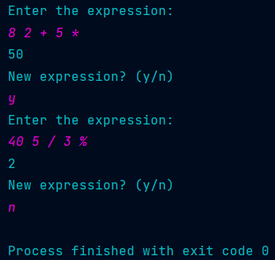

# PostFix Calculator
This repository contains a Java implementation of a postfix calculator. Postfix notation, also known as Reverse Polish Notation (RPN), is a mathematical notation in which operators follow their operands.
## Table of contents
- [PostFix_Calculator](#postfix-calculator)
  - [Table of Contents](#table-of-contents)
  - [About](#about)
  - [Installation](#installation)
  - [Usage](#usage)
  - [License](#license)

## About
Postfix notation is a convenient way to express mathematical expressions without the need for parentheses to indicate the order of operations. This implementation allows you to evaluate postfix expressions efficiently.

## Installation
To install the application simply clone the repository into your local machine.
```bash
git clone https://github.com/RyzhasMomentas/ADS1_PostFix_Calculator.git
```
compile the code and run src/main/java/org/example/Main.java application.

## Usage

The following features are provided in the project:
* Evaluate postfix expressions without the need for parentheses.
* Handles basic arithmetic operators: +, -, *, /, %.
* Provides informative error messages for invalid expressions.
* Supports integer arithmetic.

Upon launching the application, the system will request a user for an expression. The user must input numbers and operators to be used in the expression within a single line, each seperated by space. Here are a few examples of user input and results:
* 3 4 + => 7
* 5 2 * => 10
* 8 4 / => 2
* 7 3 - => 4
* 10 3 % => 1
Once the result is displayed, the system will ask if a user wishes to write another expression.
##License
This project is licensed under the MIT License. You are free to use, modify, and distribute this code for your purposes.
